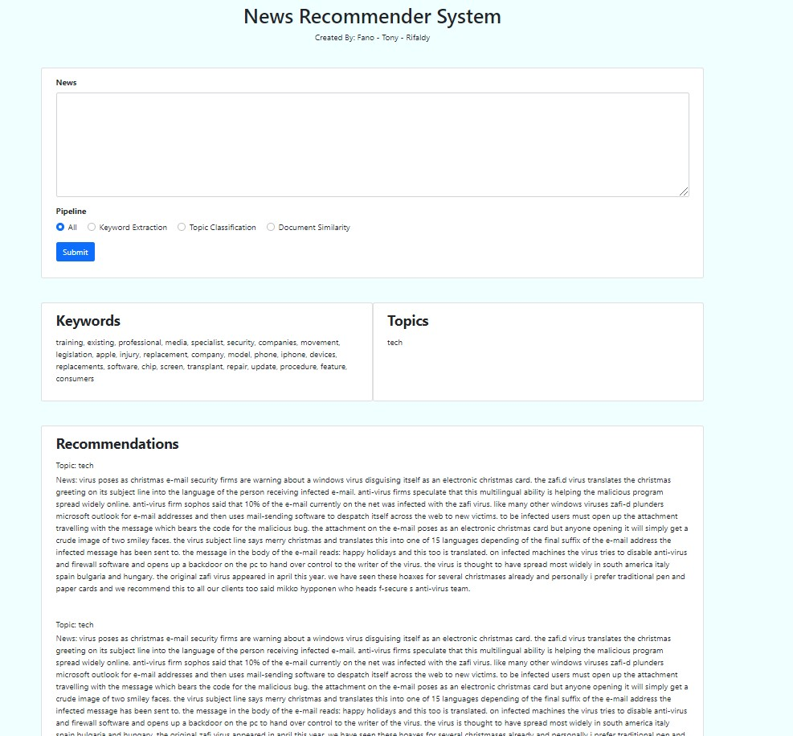

# News Recommender System

Aplikasi web untuk rekomendasi berita berdasarkan berita yang sedang dibaca oleh <i>user</i>

## Requirements

1. Install requirements yang ada di requirements.txt (direkomendasi dijalankan dalam environment Anaconda)
```
$ conda create --name <env> --file requirements.txt
```
2. Download dan ekstrak folder ``saved_models`` dan  https://drive.google.com/drive/folders/1bua1TEeuODiF6cv9_X4pSGMgCoelRr0A?usp=sharing
3. Masukan folder ``keyword extraction`` yang ada di dalam folder ``saved_models`` ke dalam folder ``News Recommendation System - 13518030 - 13518082 - 13518104/saved_models``
4. Masukan folder ``topic_classification_model`` yang ada di dalam folder ``saved_models`` ke dalam folder ``News Recommendation System - 13518030 - 13518082 - 13518104/saved_models``

## Cara menjalankan

1. Buka terminal/command prompt di dalam folder app/src
2. Jalankan ```set FLASK_APP=Web.py```
3. Jalankan ```flask run```

## Screenshot Aplikasi



## Link Video Demo

https://drive.google.com/file/d/1gR5PayMpzMKDCRqt9b5eBo_2GYSEQEX3/view?usp=sharing


## Link PPT

https://docs.google.com/presentation/d/1HkrIm1lZrL6xi1PPO_AB-AlOsdsZGGFcgl4weLjGSPc/edit?usp=sharing

## Anggota

1. Tony Eko Yuwono - 13518030
2. Rifaldy Aristya Kelana - 13518082
3. Kevin Austin Stefano - 13518104
